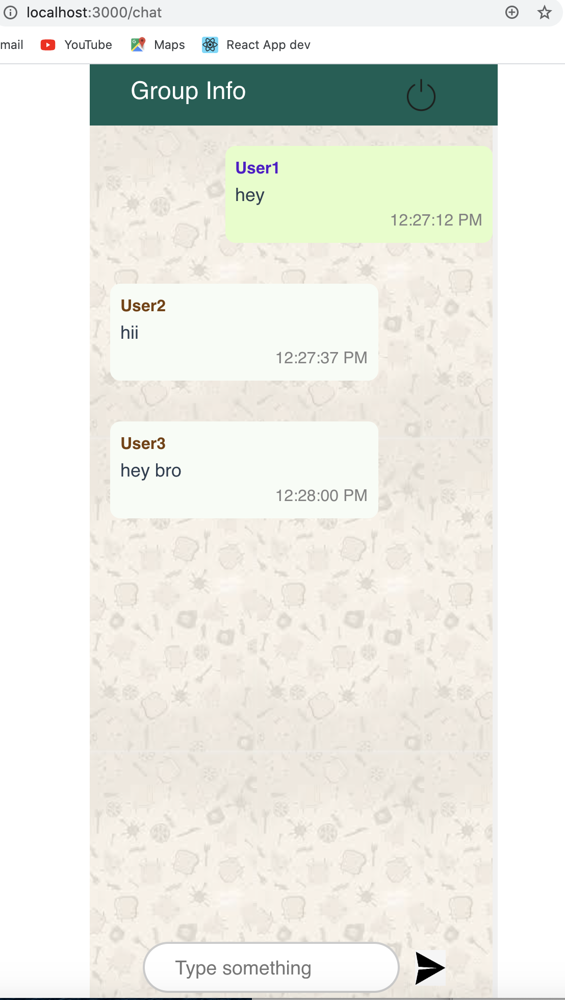
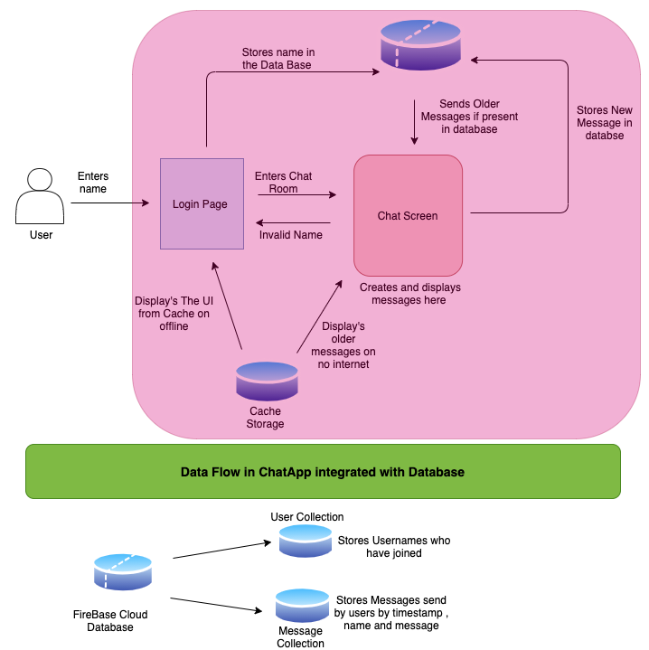

# Progressive Web ChatApp
<p align="center">
  
</p>


* This is a PWA ChatApp where users can choose a username and join a room and chat in realtime among them .
* New Users can see the older messages upon joining the room .
* All Users can see the list of the people who have joined the room by checking the **Group Info** tab .
* Users can logout of the chat by clicking the logout button and will get redirected to the login page .
* Send messages field gets disabled when network goes offline and reverts back to original as network is online 
* Users can **install** the app on their phone by clicking the **install** button on the search bar or by selecting **Add to Home Screen** option on phone
and can also use the App in **Offline Mode** .
* Older messages can be seen in ofline mode and **caching** of messaging is also done in local storage of the browser .
* All messags are stored in database 
* If a user is already logged in and tries to log in again with a new username in the same browser then he will  be redirected to his old name in that brower.

<p align="center">
  
</p>


## Project setup
Install all dependencies using command
```
npm install
```
Create a cloud database on FireBase and replace the config file in /src/firebase/init.js
```
const firebaseConfig = {
  apiKey: "",
  authDomain: "",
  databaseURL: "",
  projectId: "",
  storageBucket: "",
  messagingSenderId: "",
  appId: "",
  measurementId: ""
};
```

## Run the project using
```
npm run serve
```
### To Run in production mode
```
npm run build
```
 Start the server
```
npm start
```
## Technology Stack 
```
VueJs
Express
HTML/CSS
FireBase 
```
## Future Scope
* Adding push notification whenever user sends a new Message 
* Creating Multiple Rooms so that user can chat separtely in different rooms 
* Post the messages send by user when they were in offline mode

